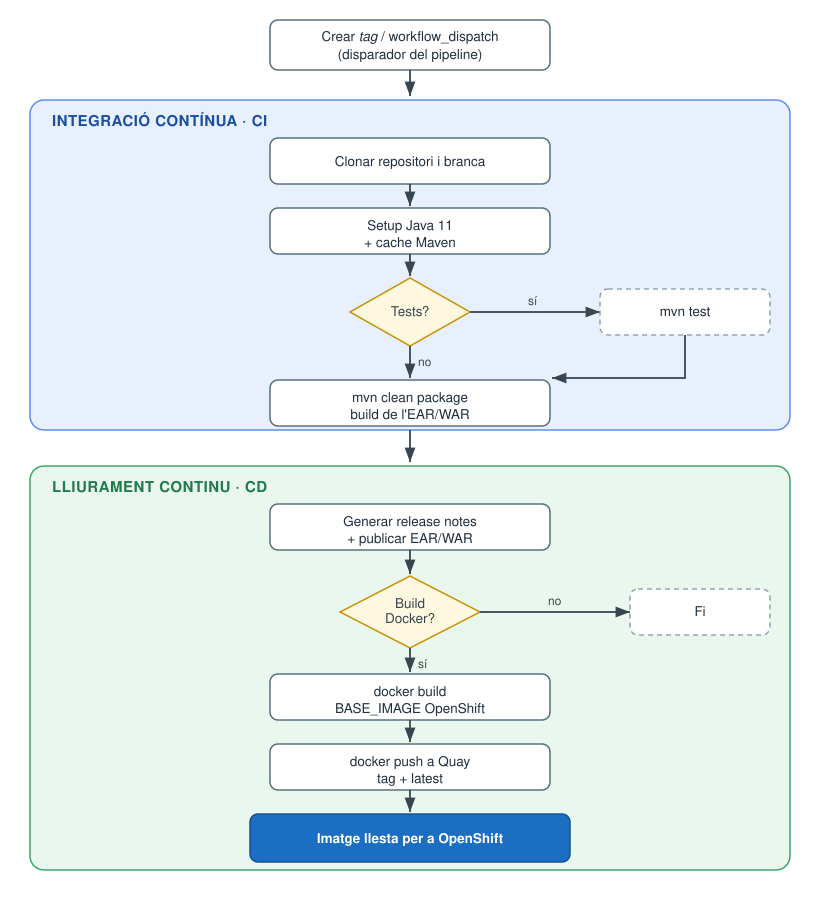

# Adaptació de RIPEA per al desplegament sobre OpenShift (PoC CI/CD)

## Resum

Per poder desplegar RIPEA sobre **OpenShift** dins un flux de **CI/CD**, s'ha
hagut de transformar la manera de construir i configurar la imatge Docker de
l'aplicació. Fins ara la imatge es generava sobre una base de JBoss pròpia que
**modificava la configuració en arrencar** (un script `jboss_config.sh` que,
amb `sed` i `awk`, injectava els subsistemes —datasources, keycloak, logging,
mail— dins el `standalone.xml` i substituïa les variables dels fitxers de
*properties* en temps d'execució). Aquest model no encaixa bé amb OpenShift, on
els contenidors s'executen amb un **UID arbitrari**, el sistema de fitxers ha de
ser de **només lectura** sempre que es pugui i la configuració s'injecta
mitjançant **ConfigMaps i Secrets**. Per resoldre-ho s'ha creat una **imatge
base de JBoss EAP 7.2 preparada per a OpenShift**, s'ha substituït la base de la
imatge de RIPEA per aquesta, s'ha reescrit el `standalone-openshift.xml` perquè
resolgui tota la configuració a partir de **variables d'entorn** (`${env.*}`)
sense scripts d'arrencada, s'ha separat la configuració en *env / configMap /
secrets*, i s'ha creat un **GitHub Action** que, en crear un *tag*, executa els
tests, construeix la imatge i la publica al registre (Quay) llesta per
desplegar. El resultat és una imatge immutable, reproduïble i parametritzable
des de fora, apta per a un pipeline automatitzat.

---

## 1. Nova imatge base de JBoss per a OpenShift

S'ha creat una imatge base corporativa
(`docker.io/goib/jboss-eap72-openshift-base`) sobre la qual desplegar els
projectes CAIB. Aquesta base ja incorpora les adaptacions necessàries per
OpenShift (permisos de grup, estructura de directoris, *entrypoint*), de manera
que els projectes només hi han d'afegir el seu artefacte i la seva configuració.

La imatge de RIPEA passa a partir d'aquesta base. Al `Dockerfile` i al
`ripea-ear/pom.xml` la imatge base és parametritzable mitjançant un *build-arg*,
de manera que el pipeline pot apuntar a la imatge publicada al registre privat
(Quay) o a la de `docker.io`:

```dockerfile
ARG BASE_IMAGE=docker.io/goib/jboss-eap72-openshift-base:latest
ARG BASE_PLATFORM=linux/amd64
FROM --platform=${BASE_PLATFORM} ${BASE_IMAGE}
```

## 2. Compatibilitat amb l'UID arbitrari d'OpenShift

OpenShift no executa els contenidors com a `root` ni amb un usuari fix, sinó amb
un **UID arbitrari** que pertany al grup `root` (GID 0). Perquè el procés de
JBoss pugui escriure als directoris que necessita (desplegaments, dades, logs,
temporals, historial de configuració), el `Dockerfile`:

- Crea explícitament els directoris de treball (`standalone/data`,
  `standalone/tmp`, `standalone/log`, `apps/ripea`, `webapps/ripea`…).
- Els assigna **permisos de grup equivalents als de l'usuari** (`chmod -R g=u`),
  de manera que qualsevol UID del grup 0 hi pugui escriure.
- Elimina i recrea el `standalone_xml_history` per evitar problemes de permisos i
  d'estat residual.
- Torna a l'usuari no privilegiat (`USER jboss`) i exposa només els ports
  necessaris (`8080`, `8787`).

## 3. Configuració per variables d'entorn (ConfigMaps i Secrets)

El canvi central és **eliminar la modificació de la configuració en temps
d'arrencada**. El nou `standalone-openshift.xml` és un fitxer complet i definitiu
que resol tots els paràmetres directament amb expressions de JBoss
`${env.VARIABLE}`, amb valors per defecte quan escau. Així no cal cap script que
manipuli el `standalone.xml` amb `sed`/`awk` en arrencar, i la configuració es
pot injectar netament des d'OpenShift.

Exemples:

- **Datasource** seleccionable per entorn (Oracle/PostgreSQL), amb URL, usuari i
  contrasenya per variables:

  ```xml
  <datasource jndi-name="java:jboss/datasources/ripeaDS" pool-name="ripeaDS" ...>
      <connection-url>${env.JBOSS_DB_URL}</connection-url>
      <driver>${env.JBOSS_DB_DRIVER}</driver>
      <security>
          <user-name>${env.JBOSS_DB_USERNAME}</user-name>
          <password>${env.JBOSS_DB_PASSWORD}</password>
      </security>
  </datasource>
  ```

- **Keycloak, mail i truststore** parametritzats igualment per `${env.*}`
  (`JBOSS_AUTH_URL`, `JBOSS_AUTH_REALM`, `JBOSS_MAIL_HOST`, `JBOSS_TRUSTSTORE`…).

- **Rutes als fitxers de configuració de l'aplicació** amb valor per defecte:

  ```xml
  <property name="es.caib.ripea.properties"
            value="${env.JBOSS_RIPEA_PROPERTIES_PATH:/opt/eap/apps/ripea/ripea.properties}"/>
  <property name="es.caib.ripea.system.properties"
            value="${env.JBOSS_RIPEA_SYSTEM_PROPERTIES_PATH:/opt/eap/apps/ripea/ripea_system.properties}"/>
  ```

Per organitzar el desplegament a OpenShift s'ha separat la parametrització en
tres fitxers de referència, dins `ripea-ear/src/main/docker/openShift/`, que es
corresponen amb els objectes natius d'OpenShift:

| Fitxer        | Objecte OpenShift | Contingut |
|---------------|-------------------|-----------|
| `os_env`      | variables d'entorn / ConfigMap d'infraestructura | Connexió a BBDD, Keycloak, mail, rutes i truststore (`JBOSS_*`). |
| `os_configMap`| ConfigMap d'aplicació | Propietats funcionals i URLs dels *plugins* (`es.caib.ripea.*`). |
| `os_secrets`  | Secret | Credencials i claus (contrasenyes de *plugins*, clau d'encriptació…). |

D'aquesta manera, les dades sensibles queden aïllades als **Secrets** i la resta
de configuració als **ConfigMaps**, sense haver de reconstruir la imatge per
canviar un paràmetre d'entorn.

## 4. Adaptació del fitxer `standalone`

El `standalone-openshift.xml` s'ha revisat i adaptat per a aquest model:

- Resolució de tota la configuració variable per `${env.*}` (sense scripts).
- Coexistència del datasource d'exemple (H2) amb el datasource real de RIPEA i
  declaració dels *drivers* Oracle i PostgreSQL.
- Ajustos propis de l'execució darrere un *router*/proxy d'OpenShift i del model
  de contenidor immutable.

Es manté com a referència l'enfocament anterior (`docker/jboss74/` amb
`jboss_config.sh`, `datasources.xml`, `keycloak.xml`, etc.) per a desplegaments
tradicionals, però el camí d'OpenShift ja **no** en depèn.

## 5. GitHub Action per a CI/CD

### Què és CI/CD?

**CI/CD** (*Continuous Integration / Continuous Delivery*) és una pràctica que
**automatitza** el camí que va des d'un canvi al codi font fins a tenir
l'aplicació desplegable. La **integració contínua (CI)** s'encarrega que, cada
cop que s'incorpora codi, es **compili i es passin els tests** automàticament,
detectant errors com més aviat millor. El **lliurament continu (CD)** continua el
procés **empaquetant l'artefacte i construint la imatge**, i la deixa **llesta
per desplegar** a un entorn (o la desplega directament). L'objectiu és reduir el
treball manual, fer els lliuraments repetibles i fiables, i guanyar rapidesa i
traçabilitat.

### Diagrama del pipeline



> El diagrama també està disponible en format PNG a
> [`screenshots/cicd-pipeline.png`](screenshots/cicd-pipeline.png) per inserir-lo
> en presentacions.

S'ha creat el workflow [`/.github/workflows/build.yml`](../.github/workflows/build.yml)
que automatitza tot el cicle. S'activa manualment (`workflow_dispatch`) —i és la
base per disparar-lo en crear un *tag*— amb paràmetres per triar repositori,
branca, si s'executen els tests i si es construeix la imatge. Les passes són:

1. **Preparació**: clonar el repositori i la branca, calcular el *tag* i obtenir
   la versió del projecte (`mvn help:evaluate` sobre `ripea-ear/pom.xml`).
2. **Entorn**: configurar Java 11 (Temurin) amb cache de Maven i carregar les
   variables des de `.env`.
3. **Tests** (opcional): `mvn test`.
4. **Build de l'EAR**: `mvn -B clean package -DskipTests=true`.
5. **Release**: generar les notes de versió a partir dels *issues* tancats del
   *milestone* i publicar l'EAR com a *release* (pre-release).
6. **Imatge Docker** (opcional): *login* a Quay, `docker build` amb la imatge
   base passada per `--build-arg BASE_IMAGE`, etiquetatge amb el *tag* i `latest`,
   i `docker push` al registre, deixant la imatge **disponible per a OpenShift**.

---

## Resultat

Amb aquests canvis RIPEA es pot empaquetar com una **imatge immutable i
reproduïble**, configurable íntegrament des de l'exterior amb **ConfigMaps i
Secrets**, compatible amb el model de seguretat d'OpenShift (UID arbitrari) i
construïble i publicable de manera **automàtica** mitjançant GitHub Actions.
Això valida la prova de concepte per adoptar un flux de **CI/CD** complet sobre
OpenShift per als projectes CAIB.

## Objectiu i avantatges

L'objectiu d'aquests canvis és **modernitzar el desplegament de RIPEA** passant
d'un model artesanal i manual —imatges construïdes i configurades a mà, amb la
configuració incrustada o modificada en arrencar— a un model **automatitzat,
immutable i orientat al núvol** que permeti integrar l'aplicació en un flux de
CI/CD sobre OpenShift. Els principals avantatges són:

- **Automatització i traçabilitat**: cada desplegament parteix d'un *tag*, que
  desencadena els tests, la construcció de l'EAR i la publicació de la imatge,
  amb notes de versió generades a partir dels *issues* del *milestone*. Es redueix
  l'error humà i es deixa constància de què conté cada versió.
- **Immutabilitat i reproductibilitat**: la mateixa imatge es promou entre
  entorns (desenvolupament, preproducció, producció) sense reconstruir-la, cosa
  que elimina les diferències «funciona a la meva màquina» i facilita el
  *rollback* a una versió anterior.
- **Separació de configuració i codi**: tota la parametrització (BBDD, Keycloak,
  *plugins*, credencials) s'externalitza en ConfigMaps i Secrets, de manera que
  canviar un entorn o una contrasenya no requereix tornar a generar la imatge i
  les dades sensibles queden aïllades.
- **Compatibilitat amb OpenShift i seguretat**: l'aplicació s'executa amb un UID
  arbitrari i sense privilegis, alineada amb les bones pràctiques de seguretat de
  la plataforma.
- **Reutilització corporativa**: la imatge base de JBoss preparada per OpenShift
  i aquest patró de configuració són reaprofitables per la resta de projectes
  CAIB, estandarditzant-ne el desplegament.
- **Escalabilitat i operació**: en encaixar amb el model de contenidors
  d'OpenShift, l'aplicació es beneficia de l'escalat, l'autorecuperació i la
  gestió d'infraestructura natius de la plataforma.

## Què ha de fer una aplicació CAIB per desplegar-se amb CI/CD sobre OpenShift

Una altra aplicació CAIB que vulgui seguir aquest mateix camí ha de fer,
essencialment, les mateixes adaptacions que s'han aplicat a RIPEA. Cal tenir en
compte que **moltes aplicacions encara no generen cap imatge Docker** (es
desplegaven com a EAR/WAR sobre un JBoss ja instal·lat), de manera que en aquests
casos els passos relacionats amb la imatge no són una modificació sinó una
**creació des de zero**. Les accions a realitzar són:

1. **Crear (o adaptar) el `Dockerfile`** perquè **parteixi de la imatge base
   corporativa de JBoss preparada per a OpenShift** en comptes d'una base pròpia
   o d'un JBoss instal·lat manualment. Si l'aplicació no generava cap imatge,
   aquest `Dockerfile` s'ha de crear de nou.
2. **Parametritzar la imatge base** amb un *build-arg* `BASE_IMAGE`, perquè el
   pipeline pugui apuntar a la base publicada al registre privat o a la pública.
3. **Copiar a la imatge només l'artefacte i la configuració** (EAR/WAR,
   `standalone`, *properties*, *truststore*…), sense incloure-hi un JBoss propi.
4. **Fer la imatge compatible amb l'UID arbitrari d'OpenShift**: crear els
   directoris de treball i assignar-los **permisos de grup** (`chmod -R g=u`), i
   executar el contenidor sempre amb un **usuari no privilegiat**.
5. **Eliminar tota configuració modificada en arrencar** (scripts amb `sed`/`awk`
   sobre el `standalone.xml`) i substituir-la per un `standalone-openshift.xml`
   complet que resolgui tots els paràmetres amb expressions `${env.*}` i valors
   per defecte.
6. **Externalitzar tota la parametrització** (connexió a BBDD, Keycloak, mail,
   *plugins*, credencials) i **separar-la** en variables d'entorn / **ConfigMaps**
   (configuració no sensible) i **Secrets** (credencials i claus), de manera que
   canviar d'entorn o una contrasenya no obligui a reconstruir la imatge.
7. **Incorporar un workflow de GitHub Actions** anàleg al de RIPEA que, a partir
   d'un *tag*, executi els tests i construeixi l'artefacte (EAR/WAR). Aquesta part
   aporta valor fins i tot a les aplicacions que **no** generin imatge Docker.
8. **(Si l'aplicació es conteneritza) afegir al workflow la construcció i
   publicació de la imatge** sobre la base d'OpenShift i el seu *push* al registre
   (Quay), deixant-la llesta per desplegar.

Com que la imatge base i aquest patró de configuració són reaprofitables,
l'esforç principal per a cada projecte es redueix a adaptar el `standalone`,
definir el mapatge de *properties* a ConfigMaps/Secrets i afegir el pipeline.